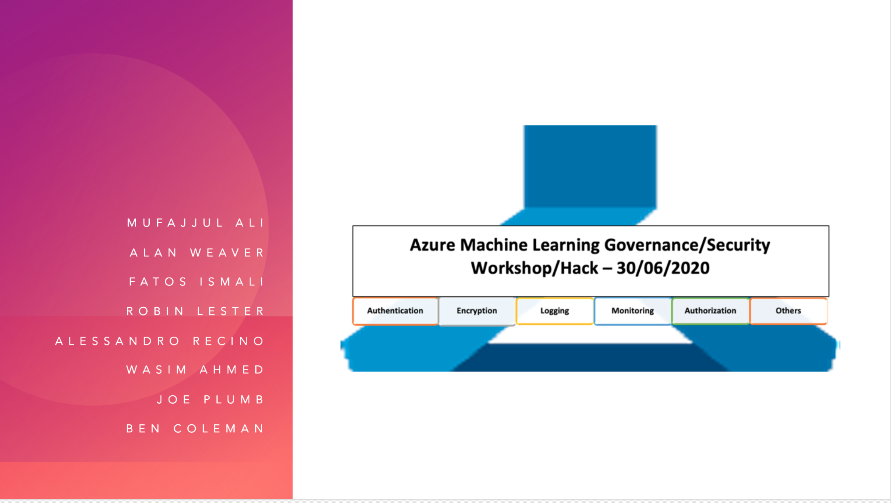
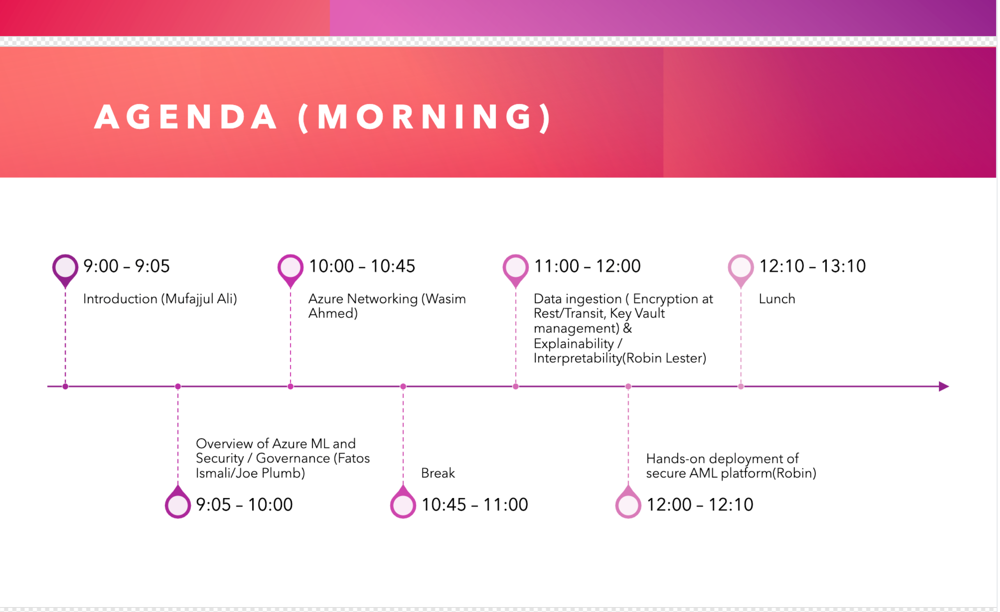
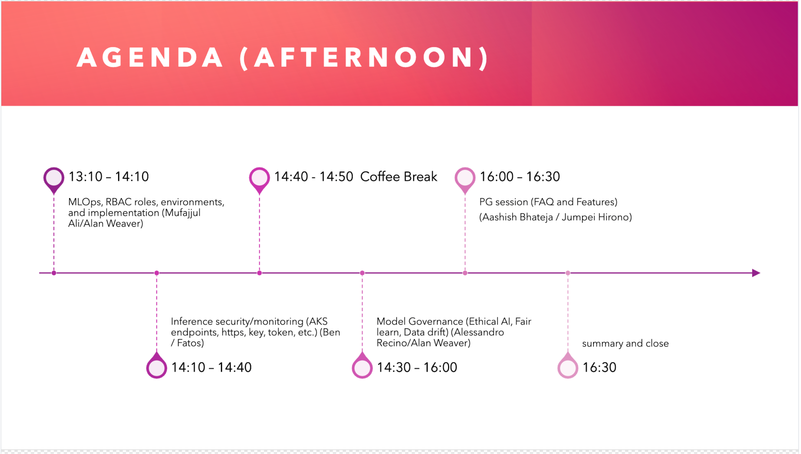

# aml-govsec2020-workshop

## Overview

Access control is a fundamental building block for enterprise customers, where protecting assets at various level is imperative to ensure that only the relevant people with certain position of authority are given the relevant access with different privileges. This is more so prevalent in machine learning, where data is absolutely essential in building ML models, and companies are highly cautious about the how the data is accessed and managed, especially with the introduction of GDPR.  We are seeing increasing number of customers seeking for explicit control of not only the data, but various stages of machine learning lifecycle, starting from experimentation to operationalization. Assets such as generated models, cluster creation and model deployment require to be governed to ensure that controls are in line with the company’s policy

This workshop/hack provides hands on experience on how to implement security and governance at various stage of ML lifecycle using Azure & AML.

## Targeted audience
General Public, Internal MS employees, Partners and Customers 

## Skillset  
MlOPs, DS, CSA, and others

## Requirements/Prequsite 
**Individuals must bring their own subscription.**

If you do not have a subscription, you can create a free account by going to this link [free azure account](https://azure.microsoft.com/en-gb/free/search/?&OCID=AID2000125_SEM_Xvn0NgAAAQ0pAAG6:20200629090126:s&msclkid=9c0eb6425d2b1b0b16dee8bba9187880&ef_id=Xvn0NgAAAQ0pAAG6:20200629090126:s&dclid=CLygivWXp-oCFUruUQod3UIHtA)

## Labs 

The labs are available on the following link [Labs](https://github.com/mufajjul/aml-govsec2020-workshop/tree/master/labs)

## Slides
The slides are available on the following link [Slides](https://github.com/mufajjul/aml-govsec2020-workshop/tree/master/slides)

##  Agenda:
-----------

----

## Team Live
Link to the Teams Live (virtual) event - the session will be available on the date and time stated in this meetup;
https://aka.ms/AMLEnterpriseReadinessWorkshop

----

# Feedback 

**Please provide feedback by visiting this link: [click here ](https://forms.office.com/Pages/ResponsePage.aspx?id=v4j5cvGGr0GRqy180BHbRy65IxdWegNLmkUZoFUsoatUMko0SjZKSjFMNjFIUzQ0Q0RENTkzWlFDNS4u)**

